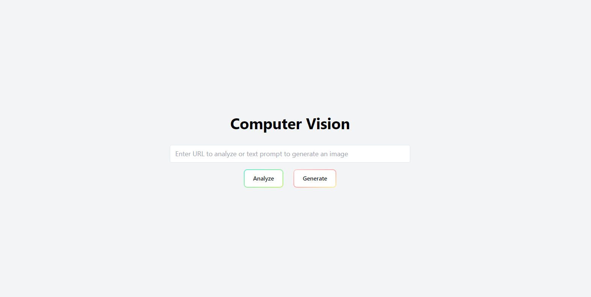

# Analyze and Generate Image with AI

This is a simple web application that allows users to analyze images using an image url like https://exampleimagesoure.com/image.jpg or generate a new image using a text description (prompt).

## Technology used

- 
- 
- 
- DALL-E 3 (preview)
- Azure Computer vision

## How to run it locally ?

1. Clone this repo
2. Copy the contents of `local.settings.json.example` file to a new file `local.settings.json`.
3. Set values of the empty fields like `VISION_ENDPOINT`, `AZURE_OPENAI_ENDPOINT`, etc. ( To get vision endpoint and api follow the prerequisite on this page [Quickstart: Image Analysis 4.0](https://learn.microsoft.com/en-us/azure/ai-services/computer-vision/quickstarts-sdk/image-analysis-client-library-40), and for Azure Open AI service configs, this page [Quickstart: Generate images with Azure OpenAI Service](https://learn.microsoft.com/en-us/azure/ai-services/openai/dall-e-quickstart?tabs=dalle3%2Ccommand-line&pivots=programming-language-javascript) )
4. Run the Azure functions locally. [Follow this guide](https://learn.microsoft.com/en-IN/azure/azure-functions/create-first-function-vs-code-node?pivots=nodejs-model-v4#run-the-function-locally)
5. Start the vite react app using `yarn dev` command.

## Screenshots

## Hosting

The app can be easily hosted using Azure Static Web App.
